<div align="center">

# NexusSec — Automated API Security Scanner

**Enterprise-grade Pentest-as-a-Service platform that scans API endpoints for vulnerabilities using Dockerized security tools, delivers real-time results via WebSockets, and produces actionable vulnerability reports.**

[](https://go.dev)
[](https://nextjs.org)
[](https://docs.docker.com/compose/)
[](https://www.postgresql.org)
[](https://www.rabbitmq.com)
[](https://redis.io)
[](https://www.mongodb.com)

</div>

---

## Overview

Modern APIs expose organizations to an ever-expanding attack surface. Manual penetration testing is slow, expensive, and doesn't scale. **NexusSec** automates this workflow:

1. A user submits an API endpoint through the dashboard
2. The API Gateway authenticates, rate-limits, and enqueues a scan job via RabbitMQ
3. The Scanner Engine picks up the job, spins up an **ephemeral Docker container** (ZAP, Nmap, or custom tools), and executes the scan in an **isolated network**
4. Results are streamed in real-time via WebSockets and stored as structured vulnerability reports
5. The dashboard presents an interactive, severity-graded report with actionable remediation steps

> **Target Audience**: This project demonstrates production-grade backend engineering, DevSecOps practices, and distributed systems design — built as a portfolio project for Backend/Pentest Intern positions.

---

## System Architecture

```mermaid
graph TB
    subgraph Frontend["Frontend (Next.js 16)"]
        UI["Dashboard UI"]
        WS["WebSocket Client<br/>Exponential Backoff"]
    end

    subgraph Gateway["API Gateway (Go + Gin)"]
        CORS["CORS"]
        RL_G["Global Rate Limiter<br/>100 req/min — FailOpen"]
        JWT["JWT Auth (RS256)"]
        RL_S["Scan Rate Limiter<br/>5 req/min — FailClosed"]
        Proxy["Reverse Proxy (5s timeout)"]
    end

    subgraph Broker["Message Broker"]
        RMQ["RabbitMQ"]
        DLX["Dead-Letter Exchange"]
        DLQ["scan_jobs_queue.dlq"]
    end

    subgraph Scanner["Scanner Engine (Go)"]
        Pool["Goroutine Worker Pool<br/>(N = SCANNER_CONCURRENCY)"]
        Docker["Docker SDK<br/>Ephemeral Containers"]
    end

    subgraph IsolatedNet["scan-network (Isolated)"]
        ZAP["ZAP Container"]
        Nmap["Nmap Container"]
    end

    subgraph Data["Data Layer"]
        PG["PostgreSQL<br/>Users, Targets, Jobs"]
        Mongo["MongoDB<br/>Vulnerability Reports"]
        Redis["Redis<br/>Rate Limit Counters"]
    end

    UI -->|HTTPS| CORS
    WS -.->|WSS| Gateway
    CORS --> RL_G --> JWT --> RL_S --> Proxy
    Proxy -->|Publish| RMQ
    RMQ -->|Consume| Pool
    RMQ -->|Nack no-requeue| DLX --> DLQ
    Pool --> Docker
    Docker -->|Creates| ZAP
    Docker -->|Creates| Nmap
    Pool -->|Status Updates| PG
    Pool -->|Store Report| Mongo
    RL_G & RL_S -->|Sliding Window| Redis

    IsolatedNet -.-x|"❌ NO ACCESS"| PG
    IsolatedNet -.-x|"❌ NO ACCESS"| Redis

    style IsolatedNet fill:#1a0000,stroke:#ef4444,stroke-width:2px
    style Gateway fill:#0a1628,stroke:#3b82f6,stroke-width:2px
    style Scanner fill:#0a1628,stroke:#10b981,stroke-width:2px
```



---

## Tech Stack & Tooling

| Layer | Technology | Purpose |
|:------|:-----------|:--------|
| **Frontend** | Next.js 16 (App Router), React 19, TypeScript, Tailwind CSS | Dashboard UI with server components |
| **API Gateway** | Go 1.23, Gin framework | Authentication, rate limiting, reverse proxy |
| **Scanner Engine** | Go 1.23, Docker SDK | Ephemeral container orchestration for scans |
| **Message Broker** | RabbitMQ 3.13 | Async job dispatch with DLQ for failed messages |
| **Relational DB** | PostgreSQL 16 | Users, targets, scan jobs (ACID transactions) |
| **Document DB** | MongoDB 7.0 | Unstructured vulnerability reports (schema-flexible) |
| **Cache** | Redis 7 | Sliding window rate limit counters (ZSET) |
| **Security Tools** | OWASP ZAP, Nmap | API vulnerability scanning, service enumeration |
| **Infrastructure** | Docker Compose | Local development orchestration |

---

## Key Technical Features

### Security

| Feature | Implementation |
|:--------|:---------------|
| **RS256 Asymmetric JWT** | Gateway verifies with public key only; private key lives exclusively in Auth Service. Algorithm pinning blocks alg-switching attacks. |
| **Dual-Layer Rate Limiting** | **Layer 1**: Global (100 req/min, FailOpen) protects all endpoints. **Layer 2**: Scan-specific (5 req/min, FailClosed) prevents container exhaustion. Both use Redis ZSET sliding windows. |
| **SSRF Prevention** | Scan containers run on an **isolated Docker network** (`scan-network`) with outbound-only internet access. **Zero connectivity** to `nexussec-network` where databases reside. Network attachment is mandatory — failure aborts the scan. |
| **SQL Injection Prevention** | All PostgreSQL queries use explicit `$1, $2` parameter binding via `sqlx` — no string interpolation, no ORM magic. |
| **Container Hardening** | `no-new-privileges` security opt, 512MB memory cap, 1 CPU limit per scan container. |

### Performance & Reliability

| Feature | Implementation |
|:--------|:---------------|
| **Goroutine Worker Pool** | `SCANNER_CONCURRENCY` goroutines consume from RabbitMQ in parallel. Prefetch count = pool size to prevent message flooding. |
| **Dead-Letter Queue (DLQ)** | Malformed/poisoned messages are Nack'd to `nexussec.dlx` → `scan_jobs_queue.dlq` for auditing. Never silently dropped. |
| **Container Lifecycle Management** | Pull → Create → Start → Wait (15min timeout) → Capture logs → **Force-remove via `defer`**. Containers never accumulate. |
| **Connection Pooling** | PostgreSQL: `MaxOpen=25, MaxIdle=10, MaxLifetime=30m`. MongoDB: `MaxPool=25, MinPool=5`. Prevents connection exhaustion under load. |
| **Polyglot Persistence** | PostgreSQL for relational data with ACID guarantees (users, jobs, status transitions). MongoDB for deeply nested, schema-flexible scan tool output. |
| **Graceful Shutdown** | Both Gateway and Scanner handle `SIGINT`/`SIGTERM` — in-flight requests complete, worker goroutines finish current scans, connections close cleanly. |

### Frontend UX

| Feature | Implementation |
|:--------|:---------------|
| **Real-Time Updates** | WebSocket hook with **jittered exponential backoff** (`delay × 2^n × [0.75–1.25]`) — prevents thundering herd on server recovery. |
| **Toast Notifications** | Connection drop shows warning (once). Reconnection shows success. Max 10 retries before persistent "Retry" action toast. |
| **Zero CLS** | Shaped skeleton loaders match the exact scan detail layout. Content transitions use `animate-in fade-in slide-in-from-bottom`. |
| **Enterprise Dark Theme** | Slate/Zinc palette. Semantic severity colors: Red=Critical, Orange=High, Amber=Medium, Blue=Low, Gray=Info. |
| **Interactive Report** | Severity card breakdown with proportional distribution bars. Sortable/searchable findings table with expandable detail rows. |

---

## Engineering Decisions & Trade-offs

### Why RS256 over HS256?

| | HS256 (Symmetric) | RS256 (Asymmetric) |
|:---|:---|:---|
| **Key distribution** | Every service shares the same secret | Only Auth Service holds the private key |
| **Blast radius** | Compromised secret → full token forgery | Compromised public key → nothing (it's public) |
| **Microservices fit** | Poor — secret must be synced everywhere | Excellent — Gateway only needs the public key |

**Decision**: RS256. In a distributed system, minimizing the number of services holding signing credentials is a fundamental security principle. The overhead of RSA operations is negligible compared to the security posture improvement.

### Why RabbitMQ over Redis Pub/Sub?

| | Redis Pub/Sub | RabbitMQ |
|:---|:---|:---|
| **Durability** | Fire-and-forget (messages lost if no subscriber) | Durable queues survive broker restarts |
| **Acknowledgment** | None | Manual Ack/Nack with requeue support |
| **Dead-lettering** | Not supported | Native DLX/DLQ for failed message auditing |
| **Back-pressure** | None | Prefetch count limits unacked deliveries |

**Decision**: RabbitMQ. Scan jobs are valuable (each triggers Docker containers and consumes compute). Losing a job silently is unacceptable. We need durability, acknowledgment semantics, and dead-letter routing — none of which Redis Pub/Sub provides.

### Why MongoDB alongside PostgreSQL?

| Concern | PostgreSQL | MongoDB |
|:---|:---|:---|
| **Schema** | Fixed, normalized | Flexible, deeply nested |
| **Data shape** | Users, targets, job status (relational) | Scan tool JSON output (varies per tool) |
| **Query pattern** | Status transitions, JOINs, pagination | Document retrieval by `scan_job_id` |
| **Consistency** | ACID transactions for state machine | Eventual consistency acceptable for reports |

**Decision**: Polyglot persistence. ZAP, Nmap, and custom scanners each output drastically different JSON schemas. Forcing this into a PostgreSQL `JSONB` column would sacrifice query performance and require constant schema evolution. MongoDB handles this naturally while PostgreSQL maintains transactional integrity for the job lifecycle.

### Why Fail-Closed on `/scans` Rate Limiter?

If Redis goes down, the global rate limiter **fails open** (availability over security for general endpoints). But the `/scans` limiter **fails closed** because each scan job spins up a Docker container. Without rate limiting, an attacker could exhaust host resources by flooding `/scans` with requests — effectively a resource exhaustion DoS. Denying requests with a `500` is the safer failure mode.

---

## Project Structure

```
NexusSec/
├── cmd/
│   ├── gateway/main.go            # API Gateway bootstrap
│   └── scanner/main.go            # Scanner Engine bootstrap
├── internal/
│   ├── domain/
│   │   ├── enum/                  # ScanStatus, ScanType, Severity
│   │   └── model/                 # ScanJob, Report + repository interfaces
│   ├── gateway/
│   │   ├── handler/               # Health checks
│   │   ├── middleware/            # JWT (RS256), Rate Limiter, CORS, Logger
│   │   ├── proxy/                 # Reverse proxy (5s timeout)
│   │   └── router/                # Route wiring with DI
│   ├── infrastructure/
│   │   ├── broker/                # RabbitMQ connection + DLQ topology
│   │   ├── cache/                 # Redis client
│   │   ├── config/                # Viper-based config loader
│   │   └── database/              # PostgreSQL (sqlx) + MongoDB pools
│   ├── repository/
│   │   ├── mongo/                 # ReportRepo (BSON operations)
│   │   └── postgres/              # ScanJobRepo (raw SQL queries)
│   └── scanner/
│       ├── callback/              # Post-scan state machine (Notifier)
│       ├── executor/              # Docker SDK lifecycle manager
│       └── worker/                # RabbitMQ consumer + goroutine pool
├── pkg/
│   ├── logger/                    # Zerolog structured logger
│   └── response/                  # Standardized JSON response builder
├── frontend/
│   └── src/
│       ├── app/(dashboard)/       # Next.js App Router pages
│       ├── components/            # Report, Scan, UI components
│       ├── hooks/                 # useWebSocket (exponential backoff)
│       └── types/                 # TypeScript type definitions
├── deployments/docker/            # PostgreSQL init.sql, MongoDB init-mongo.js
├── docker-compose.yml             # Local dev infrastructure
└── .env.example                   # Environment variables template
```

---

## Quick Start

### Prerequisites

- [Docker](https://docs.docker.com/get-docker/) & Docker Compose
- [Go 1.23+](https://go.dev/dl/)
- [Node.js 20+](https://nodejs.org/) & npm

### 1. Clone & Configure

```bash
git clone https://github.com/yourusername/nexussec.git
cd nexussec
cp .env.example .env
```

### 2. Generate RSA Keys (RS256)

```bash
mkdir -p keys
openssl genrsa -out keys/private.pem 4096
openssl rsa -in keys/private.pem -pubout -out keys/public.pem
```

### 3. Start Infrastructure

```bash
docker compose up -d
```

This launches PostgreSQL, MongoDB, Redis, and RabbitMQ with automatic schema initialization.

### 4. Run the Backend

```bash
# Terminal 1 — API Gateway
go run ./cmd/gateway/

# Terminal 2 — Scanner Engine
go run ./cmd/scanner/
```

### 5. Run the Frontend

```bash
cd frontend
npm install
npm run dev
```

Open [http://localhost:3000](http://localhost:3000) to access the dashboard.

### Verify Services

| Service | URL | Health Check |
|:--------|:----|:-------------|
| API Gateway | `http://localhost:8080` | `GET /health/live` |
| RabbitMQ UI | `http://localhost:15672` | Default: `nexussec` / `rabbitmq_secret_2026` |
| PostgreSQL | `localhost:5432` | `pg_isready` |
| MongoDB | `localhost:27017` | `mongosh --eval "db.adminCommand('ping')"` |
| Redis | `localhost:6379` | `redis-cli ping` |

---

## Environment Variables

See [`.env.example`](.env.example) for the full list. Key variables:

| Variable | Default | Description |
|:---------|:--------|:------------|
| `GATEWAY_PORT` | `8080` | API Gateway listen port |
| `JWT_PUBLIC_KEY_PATH` | `keys/public.pem` | RSA public key for JWT verification |
| `JWT_PRIVATE_KEY_PATH` | `keys/private.pem` | RSA private key for JWT signing |
| `SCANNER_CONCURRENCY` | `3` | Worker pool goroutine count |
| `SCANNER_NETWORK` | `scan-network` | Isolated Docker network for scan containers |
| `PROXY_TIMEOUT` | `5s` | Reverse proxy upstream timeout |
| `REDIS_PASSWORD` | — | Redis authentication password |

---

## Acknowledgment Strategy (RabbitMQ)

| Scenario | Action | Requeue? | Rationale |
|:---------|:-------|:---------|:----------|
| Malformed JSON message | `Nack` | No → DLQ | Dead-letter it; retrying won't fix bad data |
| DB error on MarkRunning | `Nack` | Yes | Transient; another worker can retry |
| Docker execution fails | `Ack` | — | Job was *processed* (outcome = FAILED) |
| Container non-zero exit | `Ack` | — | Job was *processed* (outcome = FAILED) |
| Scan succeeds | `Ack` | — | Job completed successfully |

---

## License

This project is licensed under the [MIT License](LICENSE).

---

<div align="center">

**Built with precision by a security-obsessed backend engineer.**

*NexusSec — Because security testing should be automated, not optional.*

</div>
