<div align="center">
  
  
  <br/>

  # NexusSec — Automated API Security Scanner

  **Enterprise-grade Pentest-as-a-Service platform. Scans API endpoints for vulnerabilities using ephemeral Dockerized tools, delivers real-time telemetry via WebSockets, and produces robust security reports.**

  [](https://go.dev)
  [](https://nextjs.org)
  [](https://docs.docker.com/compose/)
  [](https://www.postgresql.org)
  [](https://www.rabbitmq.com)
  [](https://redis.io)
  [](https://www.mongodb.com)

</div>

<br/>

## 📖 Executive Overview

**NexusSec** is a highly concurrent, distributed vulnerability scanning platform. It automates what is normally a slow, manual penetration testing cycle. Users queue target endpoints, and the system dynamically spins up isolated security containers (using engines like **OWASP ZAP** and **Nmap**) to enumerate and exploit the target. 

**Target Audience:** Built to demonstrate mastery of scale, isolation, and microservice communication. It answers the question: *"How do you safely orchestrate untrusted workloads while giving users a sub-second reactive frontend experience?"*

---

## 🏗️ System Architecture

NexusSec employs an event-driven architecture decoupled via RabbitMQ to support high-throughput job execution without blocking the REST API.

```mermaid
graph TB
    subgraph Frontend["Frontend / Dashboard"]
        UI["High-Performance UI<br/>(Next.js 16)"]
        WS["WebSocket Client<br/>(Exponential Backoff)"]
    end

    subgraph Gateway["API Gateway Service (Go)"]
        Gin["Gin Framework"]
        RL_G["Global Limiter<br/>(100 req/min)"]
        JWT["RS256 Auth"]
        RL_S["Scan Limiter<br/>(5 req/min, FailClosed)"]
    end

    subgraph Messaging["Message Broker"]
        RMQ["RabbitMQ"]
        DL["Dead-Letter DLQ<br/>Audit & Retry"]
    end

    subgraph Worker["Scanner Engine (Go)"]
        Pool["Goroutine Worker Pool"]
        DockerSDK["Docker Engine API"]
    end

    subgraph SandboxedNet["scan-network (Isolated)"]
        ZAP["OWASP ZAP Container"]
        Nmap["Nmap Container"]
    end

    subgraph Datastores["Polyglot Persistence Layer"]
        PG["PostgreSQL (ACID)<br/>Users, Targets, Jobs"]
        Mongo["MongoDB (Flexible)<br/>Deep Vulnerability JSON"]
        Redis["Redis (In-Memory)<br/>Rate Limiting Z-Sets"]
    end

    UI -->|HTTPS| Gin
    WS -.->|WSS Telemetry| Gin
    Gin --> RL_G --> JWT --> RL_S
    RL_S -->|Publish Job| RMQ
    RMQ -->|Consume| Pool
    Pool -->|Orchestrate| DockerSDK
    DockerSDK -->|Spin Up/Tear Down| ZAP
    DockerSDK -->|Spin Up/Tear Down| Nmap
    
    Pool -->|State Transitions| PG
    Pool -->|Save Tool JSON| Mongo
    RL_G & RL_S -->|ZSET Sliding Window| Redis

    SandboxedNet -.-x|"❌ Network Gap"| Datastores
    
    style SandboxedNet fill:#1a0000,stroke:#ef4444,stroke-width:2px
    style Gateway fill:#0a1628,stroke:#3b82f6,stroke-width:2px
    style Worker fill:#0a1628,stroke:#10b981,stroke-width:2px
```



---

## ⚙️ Key Engineering Decisions & Trade-offs

I intentionally avoided "easy" options. Building a security product requires stringent engineering decisions:

### 1. The Isolation Gap (SSRF Defense)
* **The Problem:** Scanners like ZAP make outgoing network requests. If an attacker submits an internal IP (like `http://10.0.0.1` or `http://postgres:5432`), the scanner container could exploit SSRF to attack NexusSec's own databases.
* **The Solution:** The scanner engine forces all ephemeral Docker containers onto a highly restricted `scan-network`. This network has strictly outbound internet access and zero routing to the inner `nexussec-network` where PostgreSQL, Redis, and MongoDB reside.

### 2. Rate Limiting — When to "Fail Closed"
* **The Approach:** NexusSec uses **Dual-Layer Rate Limiting** with Redis. 
  1. The **Global Limiter** protects general APIs and "fails open" if Redis crashes (prioritizing general availability).
  2. The **Scan Execution Limiter** strictly allows 5 requests/minute and **"fails closed"**. Why? Because each scan request triggers a compute-heavy Docker container. Allowing this to "fail open" would expose the host to immediate Resource Exhaustion DoS attacks.

### 3. Asymmetric RS256 Tokens Over HS256
* **The Decision:** Moving away from standard Symmetric JWTs (HS256) where all microservices share the same secret string. NexusSec signs tokens using an RSA Private Key held exclusively by the Auth layer. The Gateway verifies tokens using a Public Key. If the Gateway is compromised, the attacker still cannot forge signing tokens.

### 4. Polyglot Persistence: PostgreSQL + MongoDB
* **The Rationale:** We need `PostgreSQL` for transactional, ACID-compliant state machines (Users, User relationships, Job execution states). However, trying to map deeply nested, highly variable scanner output (ZAP JSON vs Nmap JSON) into rigid SQL rows or a single JSONB column degrades query performance and prevents schema evolution. `MongoDB` acts as our high-volume sink for raw, unstructured vulnerability reports.

### 5. RabbitMQ Dead-Letter Queues (DLQ)
* **The Defense:** If a poisoned or malformed scan request crashes the worker parsing logic, standard queues either drop the message entirely or loop it forever, blocking the queue. NexusSec workers utilize explicit `Nack (requeue=false)`. Failed messages are safely routed to a Dead-Letter Exchange (`nexussec.dlx`) for debugging, keeping the primary pipeline unblocked.

---

## 💻 Tech Stack Summary

| Stack Element | Technology & Version | Why Used? |
| --- | --- | --- |
| **Frontend** | React 19, Next.js 16, Tailwind, Framer Motion | SSR support, premium visual fidelity, and clean layout handling. |
| **API Backend** | Go 1.23, Gin | Raw performance, low memory footprint, and stellar concurrency abstractions. |
| **Queue / Broker** | RabbitMQ 3.13 | Ensures jobs survive gateway crashes, implements explicit ACK semantics. |
| **Worker Engine** | Go 1.23 + Docker SDK | Allows dynamic lifecycle control of containers entirely via Go code. |
| **Core Database** | PostgreSQL 16 | Absolute ACID compliance for monetary/status-based transactions. |
| **Report Database**| MongoDB 7.0 | Dynamic schemas to store unpredictable payload structures from security tools. |
| **State / Cache** | Redis 7 | `Z-Set` based sliding-window rate limiting. |

---

## ⚡ Real-Time Frontend & UX

A scanner is useless if the results are hard to digest. NexusSec features a high-end, Next.js App Router dashboard:
- **WebSocket Telemetry:** Connects to the Go backend to stream container milestones (`queued` ➡️ `running` ➡️ `parsing` ➡️ `completed`) in real-time. 
- **Resilience:** Implements programmatic **Exponential Backoff** reconnects to prevent thundering herd crashes if the gateway reboots.
- **Deep Triage UI:** Custom split-pane interfaces (like Linear/Vercel) for diffing old scans vs new scans, showing severity breakdowns, resolution statuses, and syntax-highlighted Request/Response payloads.

---

## 🚀 Running the Project

### Prerequisites
- Docker & Docker Compose
- Go 1.23+
- Node.js 20+

### Setup

```bash
# 1. Clone
git clone https://github.com/your-username/NexusSec.git
cd NexusSec

# 2. Setup Env
cp .env.example .env

# 3. Generate RS256 Asymmetric Keys
mkdir -p keys
openssl genrsa -out keys/private.pem 4096
openssl rsa -in keys/private.pem -pubout -out keys/public.pem

# 4. Spin up the infrastructure (Datastores + Broker + Docker Networks)
docker compose up -d
```

### Launch Services

Start the highly concurrent Scanner Worker:
```bash
go run ./cmd/scanner/
```

Start the API Gateway:
```bash
go run ./cmd/gateway/
```

Start the Dashboard Server:
```bash
cd frontend
npm install
npm run dev
```

Visit the dashboard locally at `http://localhost:3000`.

---
<div align="center">
  Built with precision by a security-focused engineer.<br>
</div>
