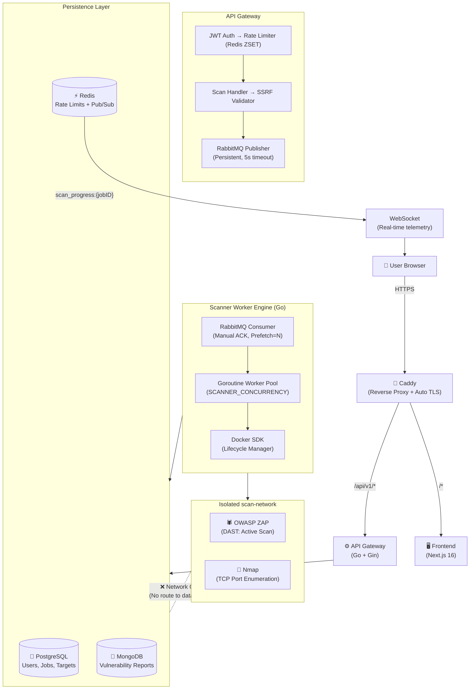

<div align="center">

# 🔐 NexusSec

### Distributed Vulnerability Scanner Platform

*Automate your security posture. Don't let attackers find vulnerabilities before you do.*

[](https://go.dev)
[](https://nextjs.org)
[](LICENSE)
[](https://github.com/Thanh36-jqk/NexusSec/actions)
[](https://docs.docker.com/compose/)
[](https://nexussec.me)

</div>

---

## 📸 Demo


> *Replace the above link with your dashboard GIF or screenshot*

---

## 🎯 Elevator Pitch

**NexusSec** eliminates the bottleneck of manual penetration testing by providing an **on-demand, distributed scanning platform**. Engineers submit a target URL, and the system autonomously orchestrates isolated **OWASP ZAP** and **Nmap** containers to deliver structured vulnerability reports — turning a multi-day security cycle into a minutes-long automated workflow.

---

## ✨ Key Features

- **🔐 Enterprise-grade Authentication** — Multi-factor login pipeline: Email/Password with **2FA OTP via SendGrid**, **OAuth2 Social Login** (Google & GitHub) with safe account linking, and stateless **RS256-signed JWTs** delivered via `HttpOnly; Secure` cookies to prevent XSS token theft.

- **⚡ Asynchronous Scan Orchestration** — Gateway publishes jobs to **RabbitMQ** (Persistent delivery mode, survives broker restarts). Worker goroutine pool consumes concurrently, spinning up ephemeral Docker containers per scan. Real-time progress is broadcast via **Redis Pub/Sub** → WebSocket.

- **🛡️ Multi-Layer SSRF Defense** — Server-Side Request Forgery is blocked at two independent layers: a Go **CIDR/DNS pre-queue validator** (blocks RFC-1918, cloud metadata IPs, loopback, `http://user@127.0.0.1` bypasses) and **Docker network segmentation** (scanner containers on `scan-network` have zero routing to internal datastores).

- **🧠 Dual-Mode Rate Limiting with FailMode** — Redis **ZSET Sliding Window** rate limiter with two behaviors: the global API limiter *fails-open* (prioritizes availability), while the scan submission limiter *fails-closed* (blocks compute abuse even if Redis is unreachable).

- **🔍 Concurrent Full-Scan Mode** — `scan_type=full` launches ZAP and Nmap **in parallel goroutines** with a 30-minute anti-zombie `context.WithTimeout`. Results are merged and deduplicated via a **Strategy Pattern parser registry** (`parser.GetParser(scanType)`), making it trivial to add new scan tools.

- **📊 Polyglot Persistence** — **PostgreSQL** (ACID state machine for users, targets, jobs) and **MongoDB** (flexible schema for deeply-nested ZAP/Nmap JSON reports) used intentionally — each database serves its optimal workload.

- **🏷️ Vulnerability Triage Engine** — Security engineers can classify findings as *false-positive* or *muted*, add investigation notes, and persist decisions per-vulnerability **fingerprint** across multiple scan runs.

- **☁️ Zero-Downtime CI/CD** — Every `git push main` triggers a **GitHub Actions** pipeline: multi-stage Docker builds → **GHCR** registry push → SSH deploy to **Azure VM** with Caddy auto-HTTPS (Let's Encrypt). RSA keys are generated ephemerally at build time.

---

## 🏗️ Architecture & Data Flow


```mermaid
flowchart TD
    User["👤 User Browser"] -->|HTTPS| Caddy["🔀 Caddy\n(Reverse Proxy + Auto TLS)"]
    Caddy -->|/api/v1/*| Gateway["⚙️ API Gateway\n(Go + Gin)"]
    Caddy -->|/* | Frontend["🖥️ Frontend\n(Next.js 16)"]

    subgraph Gateway_Internal["API Gateway"]
        direction TB
        Middleware["JWT Auth → Rate Limiter (Redis ZSET)"]
        Handler["Scan Handler → SSRF Validator"]
        Publisher["RabbitMQ Publisher\n(Persistent, 5s timeout)"]
        Middleware --> Handler --> Publisher
    end

    subgraph Worker_Engine["Scanner Worker Engine (Go)"]
        direction TB
        Consumer["RabbitMQ Consumer\n(Manual ACK, Prefetch=N)"]
        Pool["Goroutine Worker Pool\n(SCANNER_CONCURRENCY)"]
        Docker["Docker SDK\n(Lifecycle Manager)"]
        Consumer --> Pool --> Docker
    end

    subgraph Scan_Containers["Isolated scan-network"]
        ZAP["🕷️ OWASP ZAP\n(DAST: Active Scan)"]
        Nmap["📡 Nmap\n(TCP Port Enumeration)"]
    end

    subgraph Datastores["Persistence Layer"]
        PG[("🐘 PostgreSQL\nUsers, Jobs, Targets")]
        Mongo[("🍃 MongoDB\nVulnerability Reports")]
        Redis[("⚡ Redis\nRate Limits + Pub/Sub")]
    end

    Gateway --> Datastores
    Worker_Engine --> Scan_Containers
    Worker_Engine --> Datastores

    Scan_Containers -. "❌ Network Gap\n(No route to datastores)" .- Datastores

    Redis -->|"scan_progress:{jobID}"| WSS["WebSocket\n(Real-time telemetry)"]
    WSS --> User
```

**Request Lifecycle (Happy Path):**

1. `Next.js` sends `POST /api/v1/scans` with a JWT cookie.
2. **Gateway** validates JWT, runs SSRF check on target URL, inserts `scan_job` (status=`pending`) into **PostgreSQL**, publishes a `ScanMessage` JSON to **RabbitMQ** `scan_jobs_queue`.
3. **Worker** goroutine dequeues, marks job `running`, calls `DockerManager.RunScan()` → Docker Engine spins up isolated ZAP/Nmap container on `scan-network`.
4. Container runs, output is captured via stdout/stderr, container is torn down.
5. Worker's `parser.GetParser(scanType)` parses output, **Notifier** saves report to **MongoDB**, transitions job to `completed` in PostgreSQL, publishes event to **Redis Pub/Sub**.
6. Gateway's WebSocket handler broadcasts `scan_completed` → the dashboard updates in real-time, no polling required.

---

## 💻 Tech Stack

#### 🖥️ Frontend
| Technology | Version | Purpose |
|---|---|---|
| **Next.js** (App Router) | 16 | SSR, routing, dashboard |
| **Tailwind CSS** | 4 | Utility-first styling |
| **Framer Motion** | latest | Micro-animations, page transitions |
| **WebSocket API** | native | Real-time scan progress (Exponential Backoff reconnect) |

#### ⚙️ Backend
| Technology | Version | Purpose |
|---|---|---|
| **Go** | 1.23 | Gateway API & Scanner Worker |
| **Gin** | 1.12 | HTTP routing, middleware chaining |
| **golang-jwt/jwt** | v5 | RS256 asymmetric token signing |
| **golang.org/x/oauth2** | latest | Google & GitHub OAuth2 flows |
| **gorilla/websocket** | 1.5 | WebSocket server |
| **amqp091-go** | 1.10 | RabbitMQ publisher & consumer |
| **Docker SDK** | 27.x | Container lifecycle management |
| **Zerolog** | 1.34 | Structured JSON logging |
| **Viper** | 1.21 | Config management (env vars) |

#### 🗄️ Database & Cache
| Technology | Version | Purpose |
|---|---|---|
| **PostgreSQL** | 16 | Users, targets, scan job state machine |
| **MongoDB** | 7.0 | Vulnerability report storage |
| **Redis** | 7 | ZSET rate limiting + OTP TTL + Pub/Sub |

#### 🏗️ Infrastructure & DevOps
| Technology | Purpose |
|---|---|
| **Docker Compose** | Local dev & production orchestration |
| **GitHub Actions** | CI/CD pipeline (build → push → deploy) |
| **GitHub Container Registry** | Private Docker image hosting |
| **Azure VM** (Ubuntu 24.04) | Production hosting |
| **Caddy** | Reverse proxy with automatic Let's Encrypt HTTPS |

#### 🔍 Security Tools
| Tool | Purpose |
|---|---|
| **OWASP ZAP** (`zaproxy:stable`) | Dynamic Application Security Testing (DAST) |
| **Nmap** (`instrumentisto/nmap`) | TCP port scanning & service enumeration |

---

## 🚀 Getting Started

### Prerequisites

Ensure the following are installed:

```
- Docker >= 24.x  +  Docker Compose v2
- Go >= 1.23
- Node.js >= 20.x
- OpenSSL (for key generation)
```

### 1. Clone & Configure

```bash
git clone https://github.com/Thanh36-jqk/NexusSec.git
cd NexusSec

# Create your local environment file
cp .env.example .env
# → Open .env and fill in your credentials (see Environment Variables below)
```

### 2. Generate RSA Keys for JWT

```bash
mkdir -p deployments/jwt
openssl genrsa -out deployments/jwt/private.pem 4096
openssl rsa -in deployments/jwt/private.pem -pubout -out deployments/jwt/public.pem
```

> **Why?** NexusSec uses **RS256** (asymmetric) signing. The private key is held only by the Auth service; all other services verify with the public key — a compromised microservice cannot forge tokens.

### 3. Start All Services

```bash
# Bring up the full stack (infra + gateway + worker + frontend + caddy)
docker compose up -d

# Verify all services are healthy
docker compose ps
```

### 4. Run Services in Development Mode (Optional)

For hot-reload development, run services natively:

```bash
# Terminal 1 — Scanner Worker
go run ./cmd/scanner/

# Terminal 2 — API Gateway
go run ./cmd/gateway/

# Terminal 3 — Frontend
cd frontend && npm install && npm run dev
```

Dashboard is available at: **`http://localhost:3000`**

---

## ⚙️ Environment Variables

Copy `.env.example` to `.env` and fill in the values. **Never commit `.env` to version control.**

### Database & Infrastructure

| Variable | Example Value | Description |
|---|---|---|
| `POSTGRES_USER` | `nexussec` | PostgreSQL username |
| `POSTGRES_PASSWORD` | `change_me_strong` | PostgreSQL password |
| `POSTGRES_DB` | `nexussec_db` | Database name |
| `POSTGRES_HOST` | `postgres` | Hostname (Docker service name) |
| `MONGO_INITDB_ROOT_USERNAME` | `nexussec` | MongoDB root user |
| `MONGO_INITDB_ROOT_PASSWORD` | `change_me_strong` | MongoDB password |
| `REDIS_PASSWORD` | `change_me_strong` | Redis auth password |
| `RABBITMQ_DEFAULT_USER` | `nexussec` | RabbitMQ username |
| `RABBITMQ_DEFAULT_PASS` | `change_me_strong` | RabbitMQ password |

### Application

| Variable | Example Value | Description |
|---|---|---|
| `GATEWAY_PORT` | `8080` | API Gateway listen port |
| `JWT_PRIVATE_KEY_PATH` | `./deployments/jwt/private.pem` | RSA private key for signing |
| `JWT_PUBLIC_KEY_PATH` | `./deployments/jwt/public.pem` | RSA public key for verification |
| `JWT_EXPIRATION` | `24h` | JWT access token lifetime |
| `FRONTEND_URL` | `https://nexussec.me` | Used for OAuth redirect URIs & CORS |
| `SCANNER_CONCURRENCY` | `3` | Number of parallel scan goroutines |

### External Services

| Variable | Example Value | Description |
|---|---|---|
| `SMTP_HOST` | `smtp.sendgrid.net` | SMTP provider host |
| `SMTP_PORT` | `587` | SMTP port (STARTTLS) |
| `SMTP_USER` | `apikey` | SendGrid username |
| `SMTP_PASS` | `SG.xxxxxxxxxxx` | SendGrid API key |
| `GITHUB_CLIENT_ID` | `Ov23liXXXXXXXXX` | GitHub OAuth App Client ID |
| `GITHUB_CLIENT_SECRET` | `xxxxxxxxxxxxxxx` | GitHub OAuth App Client Secret |
| `GOOGLE_CLIENT_ID` | `xxxxxxx.apps.googleusercontent.com` | Google OAuth Client ID |
| `GOOGLE_CLIENT_SECRET` | `GOCSPX-xxxxxxxxx` | Google OAuth Client Secret |

---

## 🛡️ Advanced Engineering

This section documents non-trivial engineering decisions made to solve real production constraints.

### 1. Nmap TCP Connect Scan — Bypassing Azure NSG Restrictions

Azure Network Security Groups block raw socket packets (used by Nmap's default `-sS` SYN scan), causing all hosts to appear "down". NexusSec explicitly chooses `-sT` (TCP Connect) which performs a full 3-way handshake through the OS TCP stack — no raw socket privileges required.

```go
// internal/scanner/worker/worker.go
return "instrumentisto/nmap:latest", []string{
    "-sT",             // TCP Connect scan — works without raw socket (bypasses Azure NSG)
    "-Pn",             // Skip ICMP ping (Azure blocks it — all hosts appear "down" otherwise)
    "-T3",             // Normal timing (prevents accidental DoS)
    "--max-rate", "200", // Hard cap on packet rate
    "--top-ports", "1000",
    "-oX", "-",        // XML output → stdout → captured by DockerManager
}
```

### 2. OOM Prevention — Worker Memory Limits & ZAP JVM Tuning

OWASP ZAP is JVM-based. Without constraints, a single ZAP container can consume 4–8 GB RAM on large scans, triggering Linux OOM-killer and crashing the worker process. NexusSec enforces hard limits at two levels:

```yaml
# docker-compose.prod.yml — Worker container ceiling
worker:
  deploy:
    resources:
      limits:
        memory: 2G  # Total worker process cap (Go runtime + Docker SDK overhead)

# ZAP spider and scan timeouts prevent runaway workloads
"-m", "3",   # Spider max duration: 3 minutes
"-T", "10",  # Active scan timeout: 10 minutes
"-z", "-config scanner.threadPerHost=2",  # Limit concurrent threads per host
```

ZAP exit code semantics are also explicitly handled (code 2/3 = findings found, not a crash):

```go
// Only exit code 1 is a true internal ZAP error
if result.ExitCode == 1 {
    w.notifier.MarkFailed(ctx, msg.JobID, "ZAP internal crash")
    return
}
// Exit codes 2 and 3 mean alerts were found — proceed to parse normally
```

### 3. Anti-Zombie Goroutine Protection

A malicious target can employ Tar-Pit attacks — holding TCP connections open indefinitely to exhaust the worker pool. NexusSec solves this with a cascading timeout strategy:

```go
// Layer 1: Per-container Docker timeout (15 minutes) → enforced by DockerManager
// Layer 2: Per-job orchestration timeout (30 minutes) → wraps both ZAP + Nmap goroutines
scanCtx, scanCancel := context.WithTimeout(ctx, 30*time.Minute)
defer scanCancel()
// If either timeout fires, context cancels → Docker SDK kills container
// Worker goroutine exits → RabbitMQ receives Ack → queue is never blocked
```

### 4. RSA-2048 Token Integrity — The Stolen Gateway Problem

If a Gateway instance is compromised (e.g., via memory dump), it must not allow an attacker to forge tokens for other users. NexusSec solves this with **asymmetric RS256**:

```go
// Only Auth handler holds the private key (in-memory, never logged)
token := jwt.NewWithClaims(jwt.SigningMethodRS256, claims)
signed, err := token.SignedString(h.privateKey)  // RSA-2048

// All other services verify with public key only — cannot sign
jwt.ParseWithClaims(tokenString, &Claims{}, func(t *jwt.Token) (interface{}, error) {
    return publicKey, nil  // Verification only, no signing capability
})
```

In production, the RSA key pair is generated fresh on every CI/CD pipeline run (`openssl genpkey`) —  keys are never stored in the repository or image layers.

### 5. Dead-Letter Queue — Poisoned Message Containment

Malformed scan messages (e.g., corrupted JSON) would otherwise loop forever in RabbitMQ, blocking the queue indefinitely. NexusSec declares a Dead-Letter Exchange (DLX) topology and uses explicit `Nack(requeue=false)` for unrecoverable errors:

```go
// Malformed message → Nack without requeue → routed to nexussec.dlx for audit
if err := json.Unmarshal(delivery.Body, &msg); err != nil {
    delivery.Nack(false, false)  // requeue=false → goes to DLQ, not re-processed
    return
}

// Transient DB error → Nack with requeue → retried by next available worker
if err := w.notifier.MarkRunning(ctx, msg.JobID); err != nil {
    delivery.Nack(false, true)  // requeue=true → safe to retry
    return
}
```

---

## 🛣️ Roadmap

- [ ] **WebSocket scan telemetry** — Stream real-time ZAP/Nmap progress events to the frontend dashboard  
- [ ] **Scheduled Scans** — Cron-based recurring scan jobs with diff-based change detection  
- [ ] **CVSS Score Integration** — Auto-enrich vulnerabilities with CVSS 3.1 scoring from NVD API  
- [ ] **Multi-tenant Organization** — Team workspaces with role-based access control (RBAC)  
- [ ] **Webhook Alerting** — Push critical findings to Slack / PagerDuty in real-time  
- [ ] **Full Health Check API** — Deep health checks for PostgreSQL, Redis, RabbitMQ, MongoDB  
- [ ] **Prometheus Metrics** — Expose `/metrics` endpoint for Grafana dashboards  

---

## 📜 License

This project is released under the [MIT License](LICENSE).

---

## 👤 Author

**Nguyen Thanh**  
Security-focused Backend & DevOps Engineer

[](https://github.com/Thanh36-jqk)
[](https://nexussec.me)

---

<div align="center">
  <sub>Built with precision. Secured by design.</sub>
</div>
